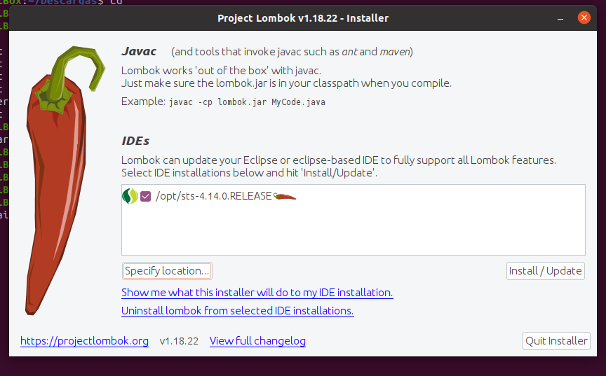

## Description
PoC Training Springboot Mongodb Backend Topics Resources

## Install some dependencies
To compile the project we must install lonbok. In our case we will use Eclipse UI.

Download lombok-1.18.22.jar configurer

[lombok 1.18.22](https://search.maven.org/remotecontent?filepath=org/projectlombok/lombok/1.18.22/lombok-1.18.22.jar)

Install lombok on Eclipse
```sh
jar -jar lombok-1.18.22.jar
```

Select where install eclipse and click on install


## Start container services

We create a network with two services: mongodb and loopback backend service

**STEP01**: Create a network for container services

```sh
docker network create training
```

**STEP02**: Start mongo db without any account, expose default mongo port and connect to previous network

```sh
docker run --name trainingdb -d -p 27017:27017 --network training mongo
```

**STEP03**: Build springboot backend image

```sh
docker build -t poc-docker-springboot-backend .
```

**STEP04**: Start springboot backend container service

Start from host the dev profile (active profile)
```sh
./mvnw spring-boot:run
```

Start from host the docker profile

```sh
./mvnw spring-boot:run -Dspring-boot.run.profiles=docker
```

Start container in docker passing the environment variable called SPRING_PROFILES_ACTIVE to activate the correct spring profile

```sh
docker run --name poc-docker-springboot-backend -d -e "SPRING_PROFILES_ACTIVE=docker" -p 8088:8088 --network training poc-docker-springboot-backend
```
